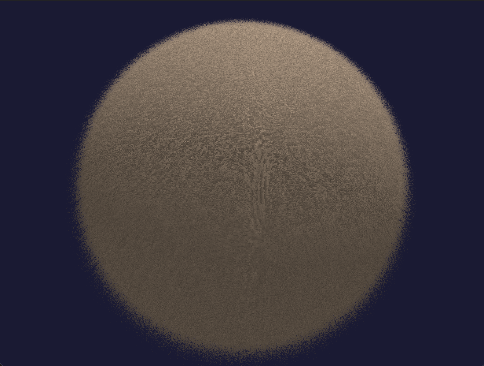

# Project Description

This project, done in OpenGL, is an experiment to demonstrates the use of shell texturing for fur rendering combined with basic physics simulation.

The scene 

# Technologies
- C++
- OpenGL
- GLFW
- GLM

# Shell Texturing Fur Rendering

A real-time fur rendering implementation using the shell texturing technique in OpenGL. This project demonstrates volumetric rendering, procedural noise patterns, and dynamic physics simulation for realistic fur effects.


*Real-time fur rendering with dynamic wind and gravity simulation*

## Overview

Shell texturing is a technique for rendering fur, grass, and other fine geometric details by rendering multiple transparent layers (shells) offset along surface normals. Each shell contains a procedural pattern that creates the appearance of individual strands, and when layered together, produces a convincing volumetric fur effect.

Shell texturing is a technique used to render seamingly complex objects

### Key Features

- **Procedural Fur Generation**: Grid-based noise patterns create unique fur strands without texture assets
- **Dynamic Physics Simulation**: Real-time gravity and wind forces that respond to camera movement
- **Adaptive Shading**: Edge-based alpha blending for smooth silhouettes and natural-looking fur boundaries
- **Interactive Controls**: Real-time adjustment of fur parameters for experimentation and tuning
- **Performance Optimized**: Instanced rendering allows 80+ layers at 110 FPS

## Technical Implementation

### Shell Texturing Algorithm

The technique renders N transparent layers (shells) positioned incrementally along the surface normal:

```glsl
// Vertex shader: Position each shell along the normal
vec3 shellPos = basePosition + normal * (layer * furLength);
shellPos += gravity * layer² * gravityStrength;
shellPos += wind * layer² * windStrength;
```

### Procedural Strand Pattern

Each shell uses a grid-based hash function to determine fur strand positions and heights:

```glsl
// Fragment shader: Generate procedural fur pattern
vec2 cell = floor(texCoord * gridFrequency);
float height = rand(cell);  // generates noise
float distFromCenter = length(fract(texCoord * gridFrequency) * 2.0 - 1.0);
(height < layer) discard;
```

### Edge-Based Alpha Blending

Smooth silhouettes are achieved through view-angle based transparency:

```glsl
float viewDot = abs(dot(normal, viewDir));
float edgeFade = smoothstep(0.0, 0.4, viewDot);  // helps smooth out angles
float alpha = edgeFade * (1.0 - layerFade);
```

## Building and Running

### Prerequisites

- CMake 3.10+
- C++17 compatible compiler
- OpenGL 3.3+ support
- GLFW3
- GLM
- GLAD

### Build Instructions

```bash
# Clone the repository
git clone https://github.com/lucasbwein/OpenGL-Shell-Texturing
cd shell-texturing

# Create build directory
mkdir build && cd build

# Configure and build
cmake ..
cmake --build .

# Run
./OpenGlShell
```

## Controls

### Camera
- **W/A/S/D** - Move camera forward/left/backward/right
- **Space/Tab** - Move camera up/down
- **Mouse** - Look around
- **R** - Reset camera position
- **Scroll** - Adjust field of view

### Rendering
- **1** - Fill mode (default)
- **2** - Wireframe mode
- **F** - Toggle flashlight
- **0** - Toggle UI mode (free cursor)

### Camera Modes
- **P** - Toggle debug camera
- **Left Shift** - Increase camera speed
- **Left Control** - Decrease camera speed

## Technical Details

### Rendering Pipeline

1. **Geometry Generation**: Procedurally generate sphere vertices with position, normal, and UV data
2. **Instanced Drawing**: Render N instances of base geometry, one per shell layer
3. **Vertex Displacement**: Each instance displaces vertices along normals based on `gl_InstanceID`
4. **Physics Simulation**: Apply gravity and wind forces with quadratic scaling by layer
5. **Fragment Processing**: Test each fragment against procedural fur pattern
6. **Alpha Blending**: Composite transparent shells front-to-back

### Performance Characteristics

- **Layers**: 80 shells (configurable)
- **Fill Rate**: ~131,000 fragments per frame (800×600 resolution)
- **Performance**: 110 FPS on modern hardware

### Shader Architecture

**Vertex Shader Responsibilities:**
- Transform base geometry to world space
- Offset vertices along normals for each shell layer
- Apply physics forces (gravity, wind) with layer-based scaling
- Pass interpolated data to fragment shader

**Fragment Shader Responsibilities:**
- Generate procedural fur pattern using grid-based noise
- Test fragment against strand pattern (height and radius)
- Calculate view-dependent alpha for edge softening
- Apply lighting (directional light with Lambertian diffuse)
- Output final color with alpha

## Parameters Reference

### Adjustable Parameters

| Parameter | Range | Default | Description |
|-----------|-------|---------|-------------|
| `numLayers` | 8-256 | 80 | Number of shell layers |
| `furLength` | 0.01-0.5 | 0.25 | Distance fur extends from surface |
| `strandThickness` | 0.3-0.95 | 0.9 | Radius of individual fur strands |
| `gridFrequency` | 500-2000 | 1500 | Density of fur grid pattern |
| `gravityStrength` | 0.0-1.0 | 0.1 | Strength of gravity effect |
| `windStrength` | 0.0-1.0 | 0.15 | Strength of wind effect |

### Presets

**Short Peach Fuzz:**
```cpp
numLayers = 32
furLength = 0.08
strandThickness = 0.65
gridFrequency = 1500
```

**Medium Fur:**
```cpp
numLayers = 64
furLength = 0.15
strandThickness = 0.85
gridFrequency = 1400
```

**Long Hair:**
```cpp
numLayers = 80
furLength = 0.25
strandThickness = 0.6
gridFrequency = 800
```

## Algorithm Analysis

### Advantages
- **Real-time Performance**: Efficient instanced rendering
- **No Texture Assets**: Fully procedural, no memory for textures
- **Dynamic Behavior**: Physics simulation responds to camera movement
- **Scalable Quality**: Adjust layers vs. performance trade-off
- **Edge Handling**: Natural silhouettes through alpha blending

### Limitations
- **Layer Banding**: Visible shell steps with too few layers, this could be fixed through using fins
- **Overdraw**: High fragment count due to layered transparency
- **Self-Shadowing**: Limited ambient occlusion (could be improved with ray marching)

## Future Improvements

### Planned Features
- [ ] Texture-based fur patterns
- [ ] Fur combing (direction maps)
- [ ] Level-of-detail system (reduce layers by distance)
- [ ] Configuration file export/import (JSON/XML)
- [ ] Ray marching

### Potential Optimizations
- [ ] Frustum culling per shell layer
- [ ] Compute shader for physics simulation
- [ ] Hierarchical Z-buffer for early fragment rejection
- [ ] Temporal anti-aliasing for smoother motion
- [ ] Variable layer density (more at silhouettes)

## References and Resources

### Learning Resources
- [LearnOpenGL - Advanced OpenGL](https://learnopengl.com/)
- [Acerola Shell Texturing Tutorial](https://www.youtube.com/watch?v=9dr-tRQzij4)
- [GPU Gems Chapter on Fur](https://developer.nvidia.com/gpugems/gpugems/part-i-natural-effects/chapter-1-effective-water-simulation-physical-models)

### Tools and Libraries
- [GLFW](https://www.glfw.org/) - Window and input handling
- [GLM](https://github.com/g-truc/glm) - Mathematics library
- [GLAD](https://glad.dav1d.de/) - OpenGL loader

## Project Structure

```
shell-texturing/
├── src/
│   ├── main.cpp           # Application entry point
│   ├── Shader.h/cpp       # Shader compilation and management
│   ├── Camera.h/cpp       # Camera system
│   └── Model.h/cpp        # Mesh loading utilities
├── shaders/
│   ├── basic.vert         # Shell texturing vertex shader
│   └── basic.frag         # Fur pattern fragment shader
├── CMakeLists.txt         # Build configuration
└── README.md
```

## Development Context

This project was developed as part of graphics programming learning.
The implementation demonstrates:

- **Real-time rendering techniques** for volumetric effects
- **Shader programming** with GLSL for procedural generation
- **Performance optimization** through instanced rendering
- **Physics simulation** for dynamic visual effects

## Author

**Lucas** - Computer Science @ San Diego State University
- Focus: Real-time rendering, shell texturing, shader programming, and tools development

## Acknowledgments

- Acerola for the comprehensive shell texturing tutorial
- LearnOpenGL.com for foundational graphics programming education
- The OpenGL community for documentation and support

---

*Last Updated: January 2026*